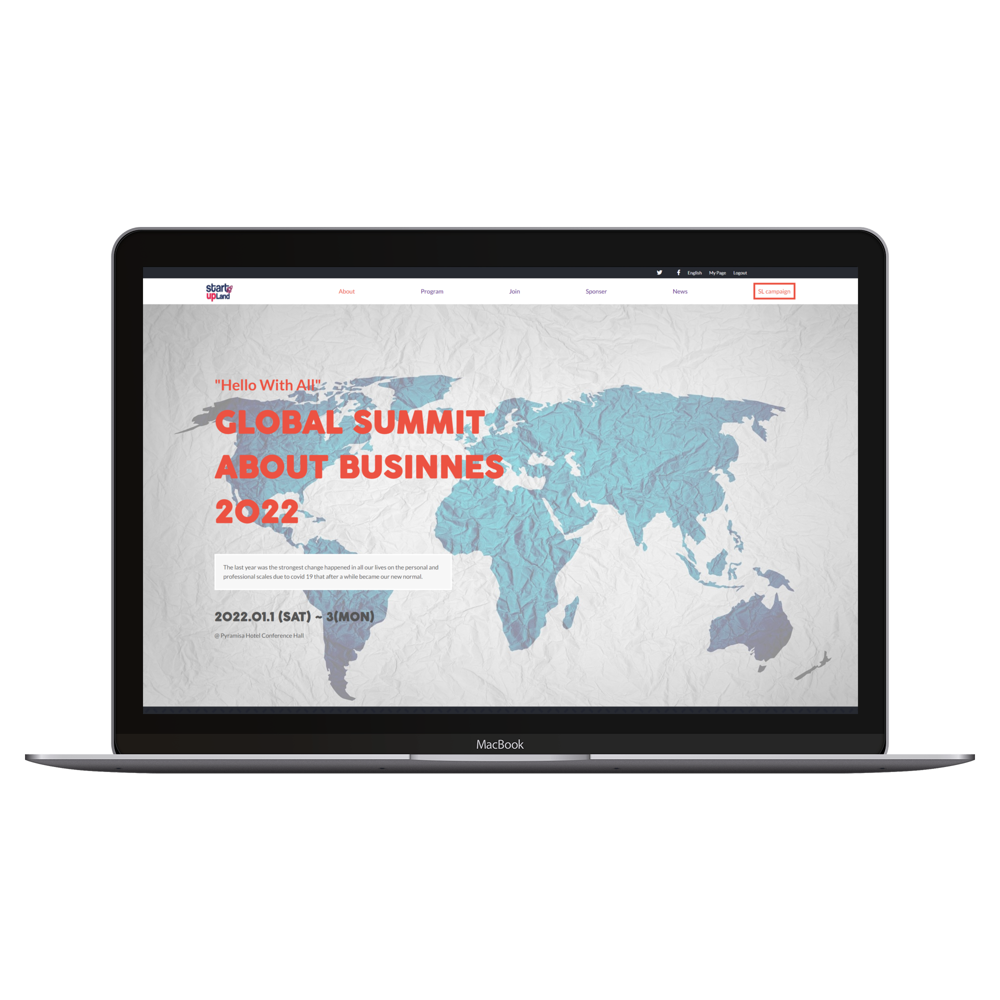

# My Portfolio Project

> This website about startup land summit 2022 contains speakers, program and sponsors.

Main features of this project:

- This project files created using github workflow
- There are two pages home and about
- Responsive for mobile and desktop version
- Add mobile menu and speakers dynamically using javascript
- Change the content to startup summit 2022

## Built With

- Html
- Css3
- JavaScript
- Linters

## Live Demo

[Live Demo Link](https://omarsalem7.github.io/Summit-event//)

## Authors

👤 **Omar Salem**

- GitHub: [@githubhandle](https://github.com/omarsalem7)
- Twitter: [@twitterhandle](https://twitter.com/Omar80491499)
- LinkedIn: [LinkedIn](https://www.linkedin.com/in/omar-salem-a6945b177/)

## Show your support

Give a ⭐️ if you like this project!

## Acknowledgments

Thanks to [Cindy Shin](https://www.behance.net/adagio07) for her design to build this project.
